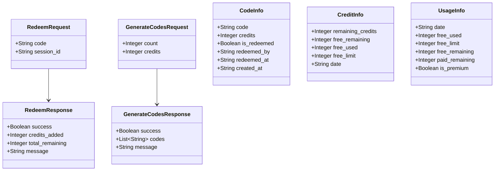
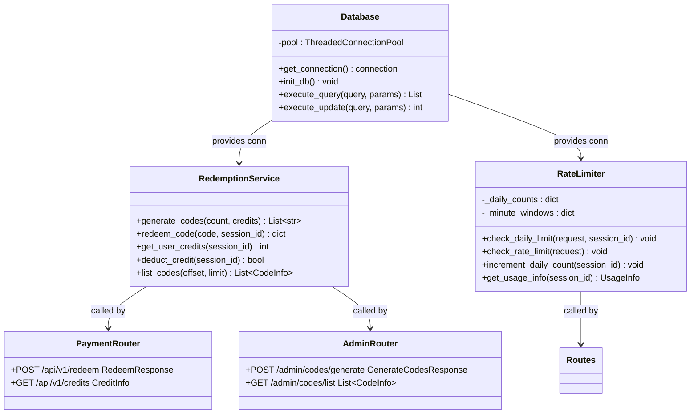
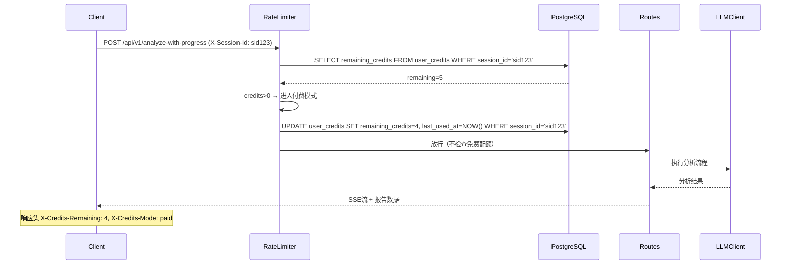
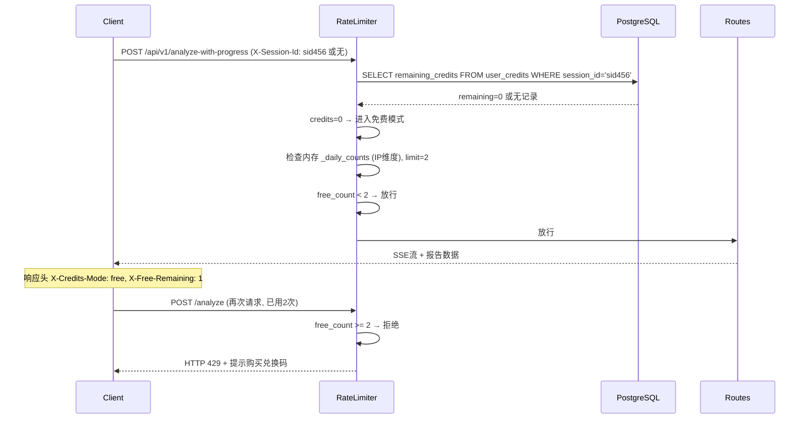
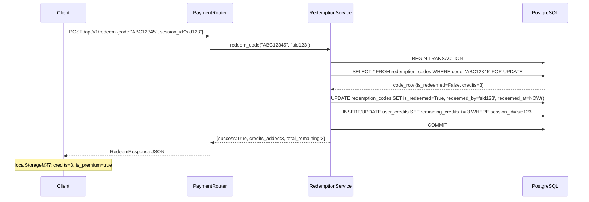
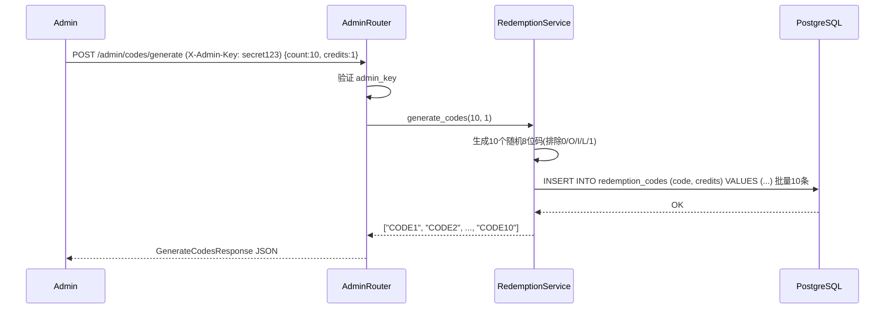
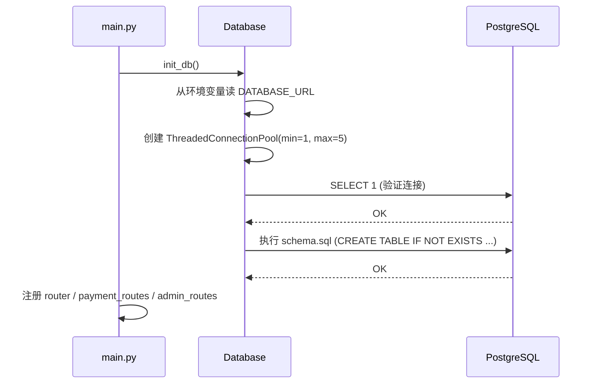
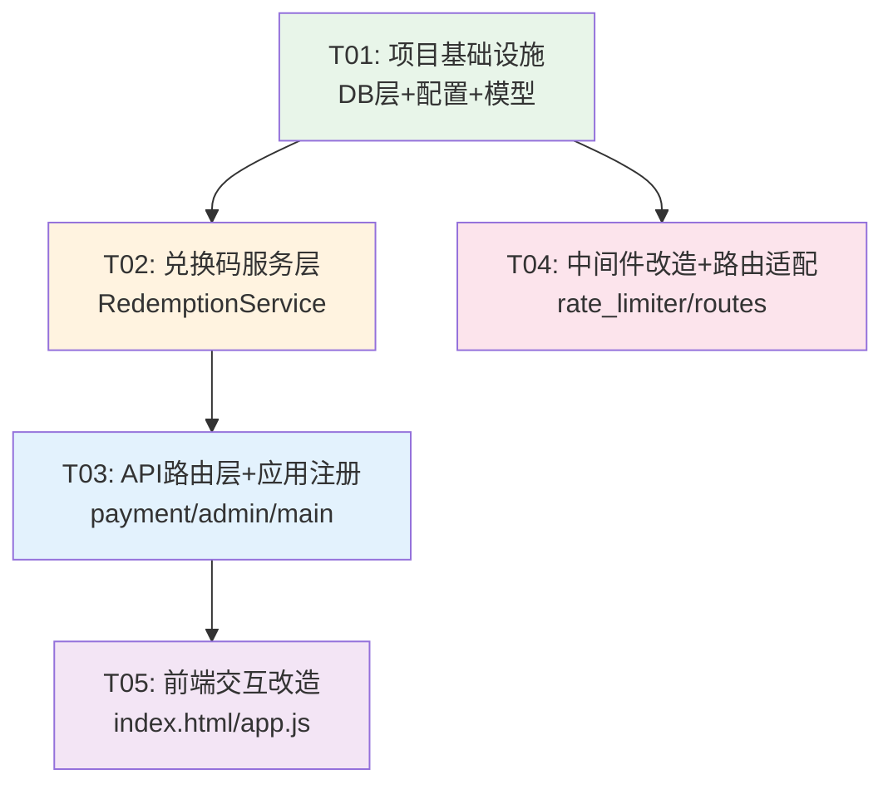

# 高考志愿填报工具 — 兑换码付费系统设计文档

## Part A: 系统设计

### 1. 实现方案

#### 核心技术挑战

| 挑战 | 分析 | 解决方案 |
|------|------|----------|
| **持久化存储** | Railway免费层无持久化磁盘，容器重启后内存/文件数据丢失 | 使用 Railway 内置 PostgreSQL（免费层1GB），通过 `DATABASE_URL` 环境变量连接 |
| **身份识别（无登录）** | 不做用户注册登录（太重），但又需追踪"谁的额度" | 客户端生成 UUID 作为 session_id，存 localStorage，每次请求通过 `X-Session-Id` 头传递 |
| **并发兑换安全** | 同一兑换码可能被多人同时兑换 | PostgreSQL `SELECT ... FOR UPDATE` 行级锁保证原子性 |
| **免费/付费双模式** | 原系统全局计数20次/天，需改为按session区分 | 改造 rate_limiter：先查 PG 付费额度，有则扣减放行；无则走免费逻辑（2次/天/IP） |
| **最小化改动** | 不破坏现有 analyze/analyze-with-progress 流程 | rate_limiter 内部逻辑改，接口签名不变；新增独立路由模块 |

#### 框架和库选择

| 选择 | 理由 |
|------|------|
| **psycopg2-binary** | PostgreSQL 驱动，纯 Python，无需编译。比 asyncpg 更简单，配合 FastAPI sync `def` 路由自动线程池执行。连接池 min=1, max=5（Railway免费层25连接上限） |
| **保留 Alpine.js + Tailwind CSS** | 前端不变框架，仅新增兑换码 UI 组件。用 Alpine.js 的 `x-data` 新增一个独立的 redeemData() 组件 |
| **UUID (Python/JS内置)** | 生成 session_id，无需额外库 |

#### 架构模式

沿用现有单体架构（FastAPI 单文件入口 + 路由模块 + 中间件），新增：
- **数据库层**（`app/db/`）：独立模块，管理 PG 连接池和建表
- **兑换码服务层**（`app/services/redemption_service.py`）：业务逻辑，与现有 services 平行
- **付费路由层**（`app/api/payment_routes.py`）：独立 APIRouter，prefix `/api/v1`
- **管理路由层**（`app/api/admin_routes.py`）：独立 APIRouter，prefix `/admin`

架构图：

```
Request → FastAPI → Middleware(rate_limiter) → Route → Service → DB/LLM
                        ↓
                   rate_limiter 改造：
                   1. 读 X-Session-Id
                   2. 查 PG 付费额度
                   3. 有额度 → 扣减放行
                   4. 无额度 → 走免费逻辑(2/day/IP)
```

---

### 2. 文件列表

#### 新增文件

| 路径 | 说明 |
|------|------|
| `app/db/__init__.py` | DB 模块入口，导出 get_db / init_db |
| `app/db/database.py` | PG 连接池管理（ThreadedConnectionPool） |
| `app/db/schema.sql` | 建表 SQL（redemption_codes + user_credits） |
| `app/services/redemption_service.py` | 兑换码业务逻辑：生成、兑换、查额度、扣减 |
| `app/api/payment_routes.py` | 用户端付费 API：兑换码、查额度 |
| `app/api/admin_routes.py` | 管理端 API：批量生成、查列表 |

#### 修改文件

| 路径 | 改动说明 |
|------|----------|
| `requirements.txt` | 新增 `psycopg2-binary>=2.9.0` |
| `app/config.py` | 新增字段：`database_url`, `admin_key`, `free_daily_limit=2` |
| `app/main.py` | 启动时调用 `init_db()`；注册 payment_routes 和 admin_routes |
| `app/middleware/rate_limiter.py` | 改造 `check_daily_limit()` / `increment_daily_count()`：先查付费额度，再走免费逻辑 |
| `app/api/routes.py` | `/usage` 端点增强：返回付费+免费综合信息 |
| `app/models/report.py` | 新增兑换码相关 Pydantic 模型 |
| `app/static/index.html` | 新增兑换码浮动按钮 + 弹窗 + 额度徽章 |
| `app/static/app.js` | 新增 redeemData() 组件 + session 管理 + 请求头注入 |

---

### 3. 数据结构与接口

#### 数据库表

```sql
-- 兑换码表
CREATE TABLE IF NOT EXISTS redemption_codes (
    id          SERIAL PRIMARY KEY,
    code        VARCHAR(8) NOT NULL UNIQUE,   -- 8位字母+数字
    credits     INTEGER  NOT NULL DEFAULT 1,  -- 可用次数(1/3/5)
    is_redeemed BOOLEAN  NOT NULL DEFAULT FALSE,
    redeemed_by VARCHAR(36),                  -- 兑换者的session_id
    redeemed_at TIMESTAMP,                    -- 兑换时间
    created_at  TIMESTAMP NOT NULL DEFAULT NOW()
);

-- 用户额度表（按session_id追踪）
CREATE TABLE IF NOT EXISTS user_credits (
    session_id      VARCHAR(36) PRIMARY KEY,  -- UUID
    remaining_credits INTEGER NOT NULL DEFAULT 0,
    total_redeemed    INTEGER NOT NULL DEFAULT 0,  -- 累计兑换次数
    last_used_at      TIMESTAMP,              -- 最近一次使用时间
    created_at        TIMESTAMP NOT NULL DEFAULT NOW()
);
```

#### Pydantic 模型（新增）



#### 服务类



---

### 4. 程序调用流程

#### 4.1 付费用户分析请求



#### 4.2 免费用户分析请求



#### 4.3 兑换码兑换流程



#### 4.4 管理员生成兑换码



#### 4.5 应用启动初始化



---

### 5. 不确定事项与假设

| 事项 | 假设 | 备注 |
|------|------|------|
| **Railway PostgreSQL 配置** | 假设已在 Railway 控制台添加 PG 插件，`DATABASE_URL` 环境变量自动注入 | 若未添加需先在 Railway 配置 |
| **session_id 丢失** | 用户清除浏览器数据会丢失 session_id，导致已兑换额度无法找回 | 前端提示"请勿清除浏览器数据"；可在兑换成功时展示 session_id 让用户截图备份 |
| **兑换码碰撞概率** | 8位(排除5个易混淆字符)≈31^8≈852亿组合，批量<100几乎不可能碰撞 | 生成时做 UNIQUE 约束兜底，插入失败自动重试 |
| **IP共享/多人同IP** | 学校/家庭可能多人共用IP，免费额度按IP计数偏严格 | 允许通过 session_id 区分（有session_id时免费额度也按session计） |
| **SSE流的额度扣减时机** | 请求放行时立即扣减，即使LLM调用失败也不退还 | 简化逻辑；可后续优化为"分析完成后扣减" |
| **admin_key 安全性** | 固定密钥，无过期/轮换机制 | 对小规模运营够用；可后续升级为 JWT |

---

## Part B: 任务分解

### 6. 依赖包清单

```
# 新增
psycopg2-binary>=2.9.0    # PostgreSQL 驱动（纯Python编译，无需gcc）

# 无需新增的其他包 — UUID是Python内置，前端仅Alpine.js原生功能
```

### 7. 任务列表（按依赖顺序）

#### T01: 项目基础设施 — 数据库层 + 配置

| 项目 | 内容 |
|------|------|
| **源文件** | `requirements.txt`, `app/config.py`, `app/db/__init__.py`, `app/db/database.py`, `app/db/schema.sql`, `app/models/report.py` |
| **依赖** | 无 |
| **优先级** | P0 |
| **描述** | ① requirements.txt 新增 psycopg2-binary；② config.py 新增 database_url / admin_key / free_daily_limit 字段；③ 创建 app/db/ 模块：database.py 实现连接池管理（ThreadedConnectionPool, min=1, max=5）、get_db() 上下文管理器、init_db() 建表函数（执行 schema.sql）；④ schema.sql 定义 redemption_codes 和 user_credits 两张表；⑤ report.py 新增 RedeemRequest / RedeemResponse / GenerateCodesRequest / GenerateCodesResponse / CodeInfo / CreditInfo / UsageInfo Pydantic 模型 |

#### T02: 兑换码服务层

| 项目 | 内容 |
|------|------|
| **源文件** | `app/services/redemption_service.py` |
| **依赖** | T01 |
| **优先级** | P0 |
| **描述** | RedemptionService 类实现：① `generate_codes(count, credits)` — 随机8位码（排除0/O/I/L/1），批量INSERT，UNIQUE碰撞自动重试；② `redeem_code(code, session_id)` — SELECT FOR UPDATE 行级锁 + 事务，原子兑换+额度累加；③ `get_user_credits(session_id)` — 查 user_credits.remaining_credits；④ `deduct_credit(session_id)` — UPDATE remaining_credits -1 + last_used_at；⑤ `list_codes(offset, limit)` — 分页查询兑换码状态 |

#### T03: API路由层 + 应用注册

| 项目 | 内容 |
|------|------|
| **源文件** | `app/api/payment_routes.py`, `app/api/admin_routes.py`, `app/main.py` |
| **依赖** | T02 |
| **优先级** | P0 |
| **描述** | ① payment_routes.py：`POST /api/v1/redeem` — 调用 redeem_code，返回 RedeemResponse；`GET /api/v1/credits` — 读取 session_id 头，返回 CreditInfo（含付费+免费额度）；② admin_routes.py：`POST /admin/codes/generate` — 验证 X-Admin-Key 头，调用 generate_codes；`GET /admin/codes/list` — 验证 X-Admin-Key，调用 list_codes，支持 ?offset&limit 分页；③ main.py：startup 事件调用 init_db()；注册 payment_routes 和 admin_routes |

#### T04: 中间件改造 + 路由适配

| 项目 | 内容 |
|------|------|
| **源文件** | `app/middleware/rate_limiter.py`, `app/api/routes.py` |
| **依赖** | T01 |
| **优先级** | P0 |
| **描述** | ① rate_limiter.py 改造 `check_daily_limit(request)`：从 request.headers 读 X-Session-Id → 查 PG 付费额度 → 有额度则 deduct_credit() 放行 → 无额度则走免费逻辑（free_daily_limit=2，按 IP 或 session_id 计数）；② `increment_daily_count(session_id)` 增加可选参数区分付费/免费计数；③ `get_usage_info(session_id)` 返回增强版 UsageInfo（含 paid_remaining / is_premium）；④ routes.py 的 `/usage` 端点改为从 request 读 session_id 后调用增强版 get_usage_info；⑤ analyze / analyze-with-progress 路由的 rate limiter 调用签名不变，内部逻辑已改 |

#### T05: 前端交互改造

| 项目 | 内容 |
|------|------|
| **源文件** | `app/static/index.html`, `app/static/app.js` |
| **依赖** | T03 |
| **优先级** | P1 |
| **描述** | ① app.js 新增 redeemData() Alpine组件：sessionId 初始化（读localStorage或生成UUID）、credits 状态管理、兑换码输入/提交、弹窗控制；② 修改 formData()：所有 fetch 调用注入 `X-Session-Id` 头；③ 429错误处理增强：检测到付费提示时显示兑换码弹窗；④ index.html：Usage Indicator 区域改造为显示"免费X次 / 付费Y次"双指标；⑤ 新增右下角浮动兑换码按钮 + 弹窗UI（输入框+提交+结果展示）；⑥ 兑换成功后刷新 usageData 显示 |

### 8. 共享知识（跨文件约定）

```
# Session 管理
- session_id: UUID v4 格式，客户端生成或从 localStorage 读取
- localStorage key: "gaokao_session_id"
- 请求头传递: X-Session-Id
- 服务端 fallback: 无 X-Session-Id 头时用 IP 地址做免费限制

# API 响应格式
- 所有新增API统一返回 {success: bool, data: object, message: str, code: int}
- success=True → 正常；success=False → 业务错误（兑换码无效/已使用等）
- HTTP状态码：200正常, 400参数错误, 401管理密钥错误, 404码不存在, 409码已使用

# 管理员认证
- 所有 /admin/* 接口需 X-Admin-Key 请求头
- 值从 .env 的 ADMIN_KEY 读取
- 缺失或错误 → HTTP 401 {"success":false, "message":"管理员密钥验证失败"}

# 数据库操作
- 统一通过 app/db/database.py 的 get_db() 获取连接
- get_db() 是上下文管理器：with get_db() as conn → 自动 commit/rollback
- 新路由用 sync def（FastAPI自动线程池执行）
- 异步路由（如 analyze-with-progress）中调用DB用 asyncio.to_thread()

# 兑换码格式
- 8位字符，大写字母+数字
- 排除易混淆字符: 0(零), O(欧), I(衣), L(勒), 1(一)
- 可用字符集: A,B,C,D,E,F,G,H,J,K,M,N,P,Q,R,S,T,U,V,W,X,Y,Z,2,3,4,5,6,7,8,9 (共31个)
- 生成时利用 PG UNIQUE 约束防碰撞，INSERT 失败自动重试

# 免费额度
- 原系统 daily_request_limit=20 改为 free_daily_limit=2
- config.py 保留 daily_request_limit 字段但设为2，原代码兼容
- 付费用户不受免费日限约束

# 响应头约定
- X-Credits-Mode: "paid" | "free" — 标识当前请求走哪种模式
- X-Credits-Remaining: 数字 — 付费用户剩余额度（仅付费模式）
- X-Free-Remaining: 数字 — 免费用户今日剩余次数（仅免费模式）

# 连接池配置
- psycopg2 ThreadedConnectionPool(minconn=1, maxconn=5)
- Railway PG 免费层25连接上限，本项目仅用5个
- 连接获取失败 → HTTP 503 {"success":false, "message":"数据库连接异常，请稍后重试"}
```

### 9. 任务依赖图



> **说明**：T04 与 T02/T03 无直接依赖（T04 只依赖 T01 的 DB 层），可并行开发。T05 依赖 T03 的 API 端点就绪。推荐执行顺序：T01 → T02 → T03 → T04 → T05，其中 T04 可在 T02/T03 开发期间并行推进。
